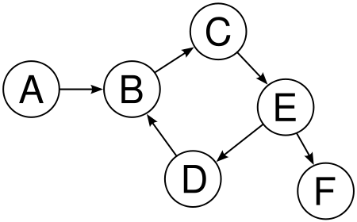
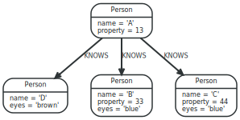

title: Graph Databases And Ruby

output: presentation.html

controls: true

theme: sudodoki/reveal-cleaver-theme

--

# Graph Databases And Ruby

## Using Neo4J to make applications based around graphs

--

### What is a Graph?

-	A series of vertices connected by edges

-	Each vertex represents an entity in the graph

-	Each edge is a relationship between two entities

-	Can be directed or undirected

-	Edges and Vertices can have properties

--

### What it looks like



--

### What can they model?

-	Anything that has relationships between things

-	A social network

-	Item catalogues

-	Movie listings with actors/directors/genres

- User interactions

--

### Why use them?

-	Easier to model data with relationships

-	Easier to do complex traversals between nodes

-	Traversal is more efficient than tables, nodes link directly by reference

- Look Ma, no JOINs!

--

### Quick view

Make some stuff

```
CREATE (a:Person {name:'A'} )
CREATE (b:Person {name:'B'} )
CREATE (c:Person {name:'C'} )
CREATE (d:Person {name:'D'} )
CREATE (a) -[:Friend]-> (b)
CREATE (a) -[:Friend]-> (c)
CREATE (a) -[:Friend]-> (d)
CREATE (b) -[:Friend]-> (d)
CREATE (c) -[:Friend]-> (d)
```

Search some stuff

```
MATCH (me:Person)-->(friend:Person)-->(friend_of_friend:Person)
WHERE me.name = 'A'
RETURN count(DISTINCT friend_of_friend), count(friend_of_friend)
```

--

### With code!

```ruby
query = "CREATE (n { nodes })\nRETURN n AS node"

nodes = {
  :nodes => [{
    :name => "Foo"
  }, {
    :name => "Bar"
  }, {
    :name => "Baz"
  }]
}

@neo.execute_query(query, nodes)
```

--

### Cypher

```
MATCH (node1:LABEL{property:"value"}) -[relationship:LABEL]-> (node2) RETURN node2
```

-	A query language made for Neo4J

-	Makes traversing graphs as simple as ascii art

-	Language is similar to SQL

--

### Read operations

-	Patterns : Patterns describe nodes or paths

-	`MATCH` : Searches for nodes, relationships, or paths that match a given pattern

-	`WHERE` : Narrows down the search with additional constraints

- `RETURN` : Return the results for the query

- `ORDER BY` : Order the results of the query

- `SKIP` / `LIMIT` : Number of results to skip / Max number of results to get

--

### Write operations

- `CREATE` : Creates new nodes or relationships

- `MERGE` : Match a pattern, or create it if it doesn't exist

- `SET` : Set a property of a node or relationship

- `DELETE` : Delete a node or relationship from the graph

- `REMOVE` : Remove a label or property from a node/relationship

--

### Example graph



--

### Find the number of unique relationships

```
MATCH (a)-[r:KNOWS]-(b)
RETURN count(DISTINCT r) As relationships
```
|relationships|
|---|
|3|

--

### Find all the names, alphabetically

```
MATCH (n)
RETURN n.name AS name
ORDER BY n.name
```
|name|
|----|
|A|
|B|
|C|
|D|

--

### Add some rivalries

```
MATCH (a { eyes: "brown" })
WITH a
MATCH (b { eyes: "blue" })
WITH a, b
CREATE (a)-[h:HATES]->(b)
RETURN h AS hate
```
|hate|
|----|
|(0)-[3:HATES]->(2)|
|(0)-[4:HATES]->(3)|

--

### Everyone (without blue eyes) who knows someone that knows someone with blue eyes

```
MATCH (a)-[:KNOWS]-(b)-[:KNOWS]-(c { eyes:"blue" })
WHERE NOT a.eyes = "blue"
RETURN DISTINCT a AS who
```

|who|
|---|
|(0:Person {eyes:"brown", name:"D"})|

--

### Find the most popular person

```
MATCH (a)-[r:KNOWS]-(b)
WITH a.name AS name, count(r) AS knows
RETURN name, knows
ORDER BY knows DESC
LIMIT 1
```

|name|knows|
|---|---|
|A|3|

--

### Using with Ruby

- [neo4j-core](https://github.com/neo4jrb/neo4j-core/wiki) : Wrapper for entire Neo4J API for ruby. Supports embedded Neo4j when using JRuby

- [neo4j](https://github.com/neo4jrb/neo4j) : An Active Model wrapper that users neo4j-core

- [neography](https://github.com/maxdemarzi/neography) : A wrapper over the Neo4j REST API

--

### Using Neography

- Get a server URL (default url for local servers is http://localhost:7474)

- Make a connection

``` ruby
@neo = Neography::Rest.new("http://localhost:7474");
```

- Disregard the rest of the API and just run queries!

``` ruby
@neo.execute_query("MATCH (n) WHERE n.name= {name}", {:name => "A"});
```

--

### Summary

- Represent your data as nodes connected by relationships

- Traverse complex relationships without the overhead of joins

- Simple query language that's similar to SQL

- Fun!
